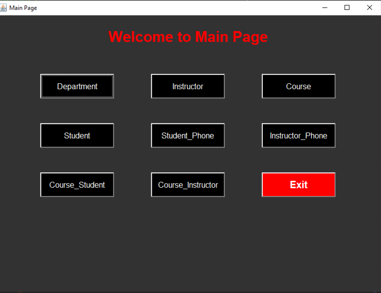
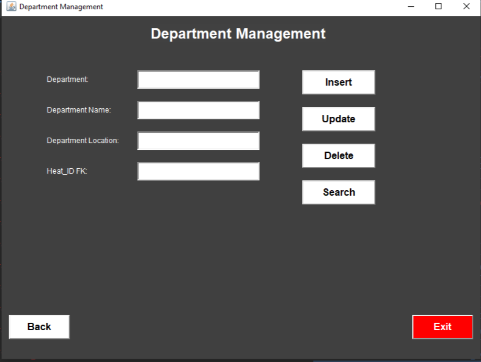
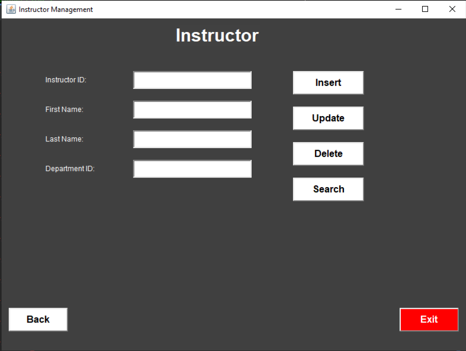
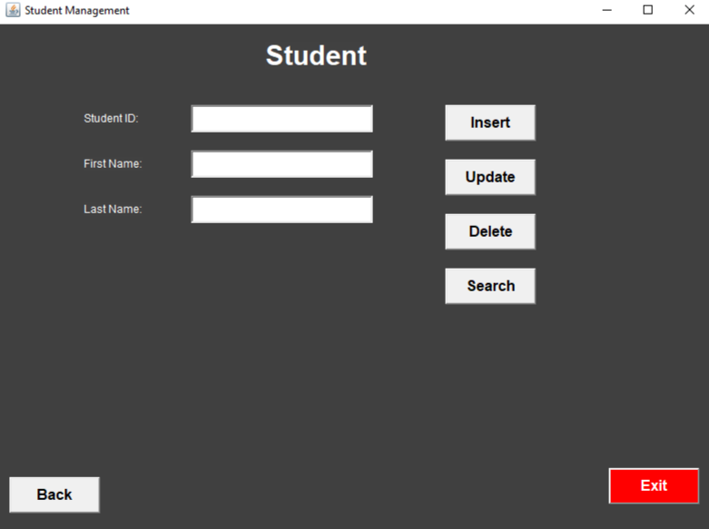
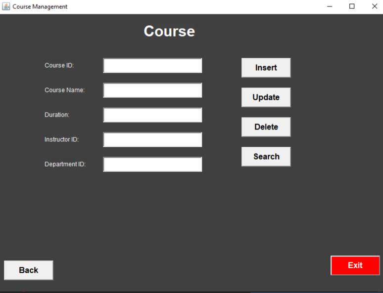
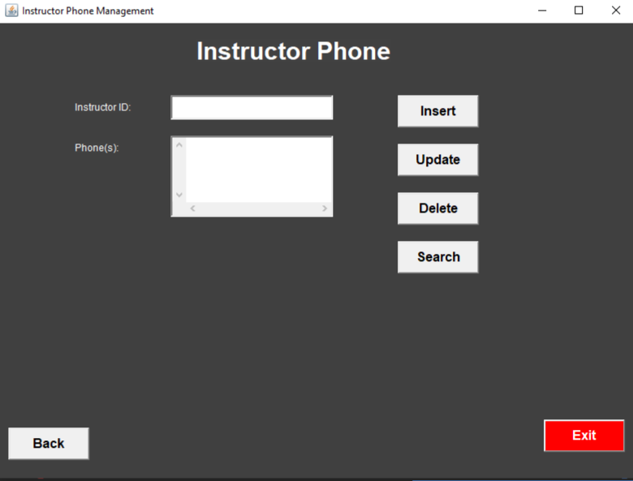
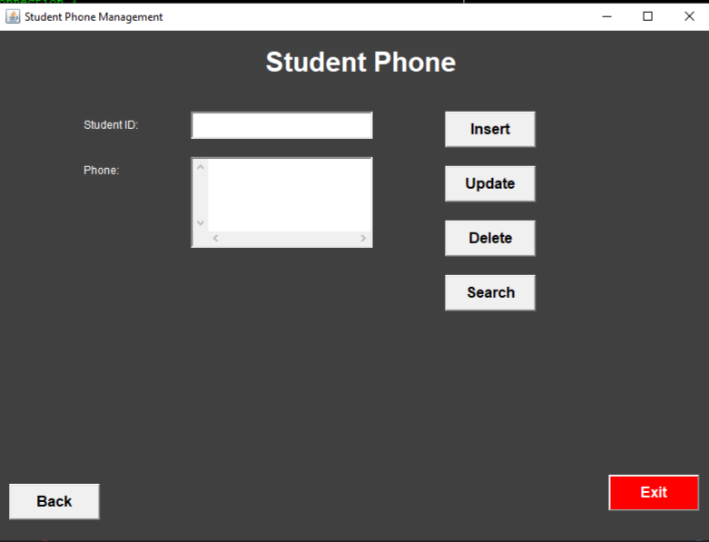
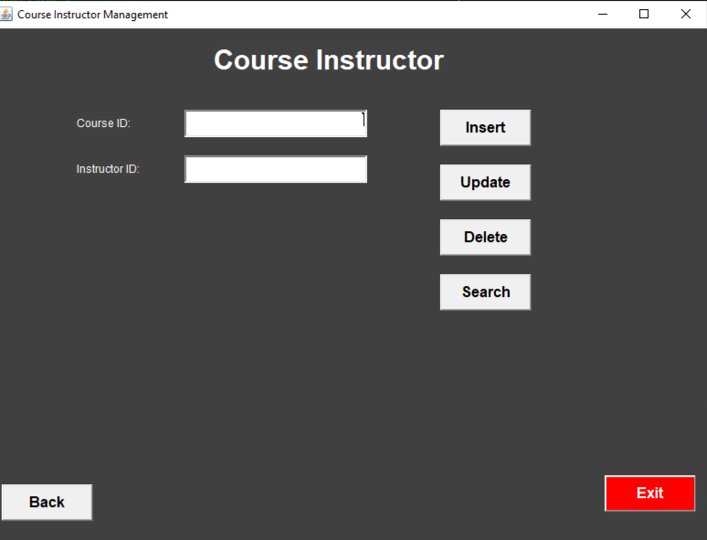
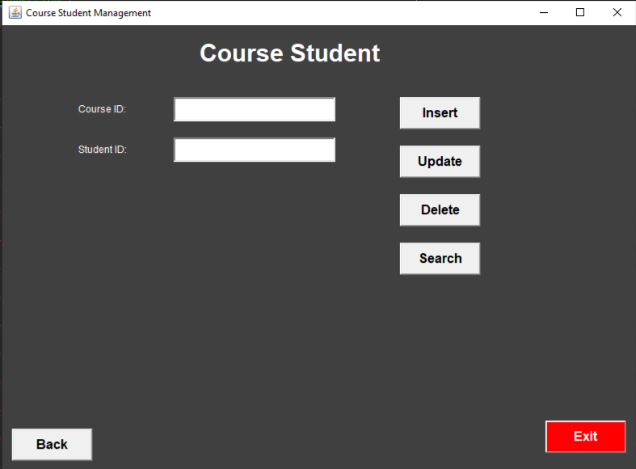
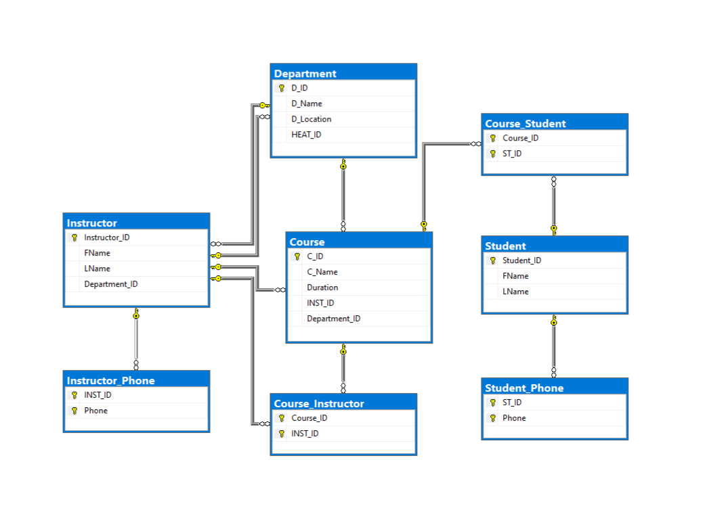

<div align="center">

# 🎓 University Management System

### Java Desktop Application for University Database Management


<br>
<br>

<br>
A Java desktop application developed as a university project for managing students, instructors, departments, courses, and their relationships using Microsoft SQL Server.

</div>

---

# 📖 About The Project

The **University Management System** is a Java desktop application developed using **Java Swing**, **JDBC**, and **Microsoft SQL Server**.

The system provides a user-friendly graphical interface for managing university data, including students, instructors, departments, courses, phone numbers, and course assignments.

The application performs complete CRUD (Create, Read, Update, Delete) operations while maintaining relationships between entities using a relational SQL Server database.

This project was developed as part of the **Database Systems** course at **Modern Academy**.

---

# ✨ Key Features

## 👨‍🎓 Student Management
- Add new students
- Update student information
- Delete students
- Search students

## 👨‍🏫 Instructor Management
- Add instructors
- Update instructor information
- Delete instructors
- Search instructors

## 🏢 Department Management
- Create departments
- Edit department information
- Delete departments
- Search departments

## 📚 Course Management
- Add courses
- Update courses
- Delete courses
- Search courses

## 📞 Phone Management
- Student phone management
- Instructor phone management

## 🔗 Relationship Management
- Assign students to courses
- Assign instructors to courses

## 💾 Database Features
- CRUD Operations
- SQL Server Integration
- JDBC Connectivity
- Relational Database Design

---

# 🛠 Technologies Used

| Technology | Purpose |
|------------|---------|
| Java | Programming Language |
| Java Swing | Desktop GUI |
| JDBC | Database Connectivity |
| Microsoft SQL Server | Database |
| NetBeans IDE | Development Environment |

---

# 🏗️ System Architecture

The project follows a simple layered architecture:

- Java Swing for the graphical user interface.
- JDBC for communication with SQL Server.
- SQL Server for storing university data.
- Java Classes for implementing business logic.

---

# 🗄️ Database Design

The database was designed using normalization principles to maintain data consistency and integrity.

### 📄 Entity Relationship Diagram (ERD)

📑 [ERD.pdf](docs/ER%20Model.pdf)

### 📄 Database Schema

📑 [Database-Schema.pdf](docs/Schema.pdf)

### 📄 SQL Script

📑 [UniversityDB.sql](database/UniversityDB.sql)

---

# 🗂️ Database Tables

- Department
- Student
- Instructor
- Course
- StudentPhone
- InstructorPhone
- CourseStudent
- CourseInstructor

---

# 🚀 How to Run

### Requirements

- Java JDK
- NetBeans IDE
- Microsoft SQL Server
- SQL Server Management Studio (SSMS)

### Installation

1. Clone the repository

```bash
git clone https://github.com/MarkNader10/University-Management-System.git
```

2. Open the project using NetBeans.

3. Create a database in SQL Server.

4. Import

```
database/UniversityDB.sql
```

5. Update your SQL Server credentials inside

```
DBConnection.java
```

6. Run the project.

---

# 📸 Screenshots

## 🏠 Main Page

<p align="center">

</p>

---
## 🏢 Department Management

<p align="center">

</p>

---
## 👨‍🏫 Instructor Management

<p align="center">

</p>

---

## 👨‍🎓 Student Management

<p align="center">

</p>

---

## 📚 Course Management

<p align="center">

</p>

---


## 📞 Instructor Phone Management

<p align="center">

</p>

---

## 📞 Student Phone Management

<p align="center">

</p>

---

## 🔗 Course - Instructor

<p align="center">

</p>

---

## 🔗 Course - Student

<p align="center">

</p>

---

<p align="center">

<a href="video/UniversityManagementSystem.mp4">



</a>

</p>

<p align="center">

▶️ Click the image above to watch the project video.

</p>

---

# 👨‍💻 My Contribution

This project was developed as a **team project (4 members)**.

### My Role

- Developed the Java Swing graphical user interface.
- Connected the application to SQL Server using JDBC.
- Implemented CRUD operations for all modules.
- Designed database relationships.
- Developed navigation between application windows.
- Tested and debugged the system.

---

# 📌 Future Improvements

- User Authentication System
- Admin Dashboard
- Search Optimization
- Export Reports to PDF
- Statistics Dashboard
- Role-Based Access Control
- Improved UI Design
- Backup & Restore Database

---

# 📄 Academic Information

**Course:** Database Systems

**Language:** Java

**Database:** Microsoft SQL Server

**IDE:** NetBeans IDE

**Faculty:** Computer Science

**Institution:** Modern Academy

---

<div align="center">

### ⭐ If you found this project useful, consider giving it a star!

</div>
